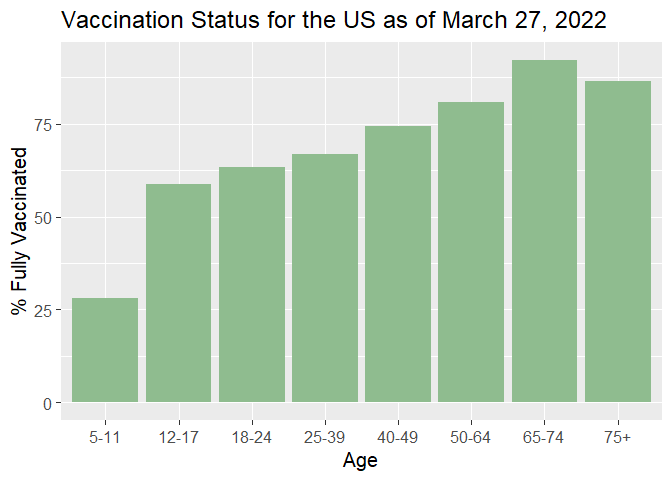
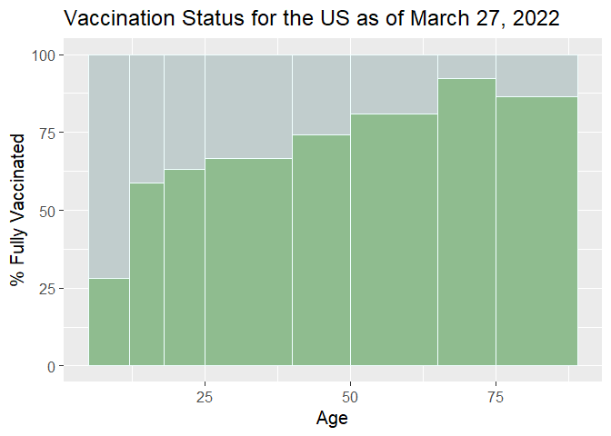
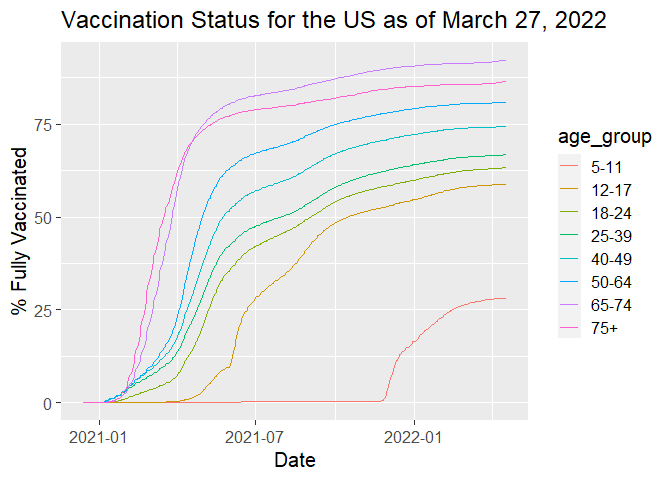
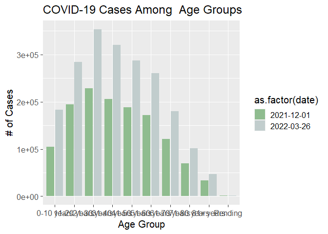
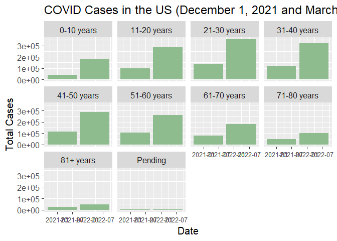
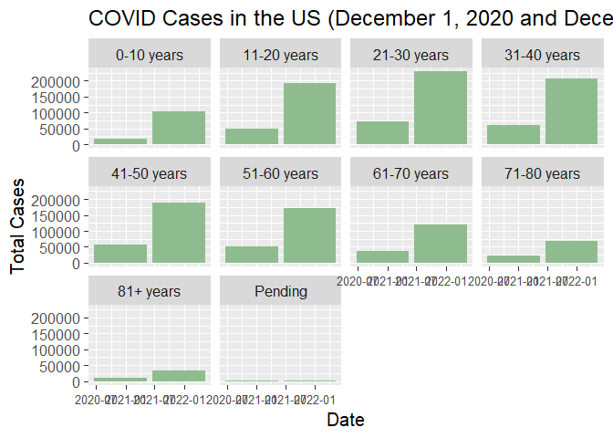

# Correlation Between COVID Cases and Vaccination Status Among Different Age Groups in the U.S.

Mikayla Bolduc1

Minnesota State University Moorhead Biosciences Department1

## Abstract

-   COVID cases have increased among all age groups from December of 2021 going into March of 2022.

-   COVID vaccine rates have increased among all age groups and continue to.

-   The increase in both COVID cases and vaccination rates both increased but this doesn’t necessarily mean that the vaccines are ineffective.

    -   There can be many reasons for this like the different variants being spread at this time. Such as the Omicron variant that was between December 2021-March 2022.
    
- Ran a Chi-squared test on the total cases from 2020 and 2021 and found that 2021 was statistically significant and higher than 2020.

## Introduction

COVID-19 vaccinations in the U.S. first became available to select population back in June 2020, right after COVID-19 was declared a pandemic in March, causing a lockdown to try to prevent it (Tsai et al., 2021). Now, the vaccines are available to everyone, along with a booster shot.  

This vaccine has been controversial with China have the most positive acceptance rates (Lazarus et al., 2021). Some studies have been done on effectiveness of the vaccines and how can variants have an affect this data (Tregoning et al., 2021). 

In this project, we will be looking at the relationship between the number of COVID-19 cases and the number of people vaccinated between age groups. We want to show the effectiveness of the vaccine. We will be using data from the CDC. 

We will be looking at the whole population of the U.S. to get more accurate information on the effectiveness of the COVID-19 vaccine where we are.

## Methods

### Data Acquisition

COVID data: Cases

1.  Go to
    <https://www.tn.gov/health/cedep/ncov/data/downloadable-datasets.html>
2.  Scroll to the “Daily Age Group Outcomes” download and click
3.  Click on “Show in folder”
4.  Copy data set
5.  Paste in data folder (Public_Dataset_Age_1\_)

COVID data: Vaccination Status

1.  Go to
    <https://data.cdc.gov/Vaccinations/COVID-19-Vaccination-Demographics-in-the-United-St/km4m-vcsb>
2.  Scroll to “View Data”
3.  Click on the Export Tab
4.  Click on CSV
5.  Save to data folder
    (COVID_19_Vaccination_Demographics_in_the_United_States_National_1\_.csv)

-   Print both data sets into an Rscript in R.
-   Filter data set to get the variables that are needed for this project.
-   Graph the data sets.

## Results

This is the first graph I made that looked at the percent of fully vaccinated people in each age group. This defines fully vaccinated by having a full vaccination plus the booster.

<!-- -->

This is the first graph but I changed it to make the columns to being the width of the age group since not all the age groups were over the same range in ages.

<!-- -->

This is a time-wise graph of vaccination rates and it shows when each of these age groups were getting the vaccine while also showing the percent of the age group vaccinated at a point in time.

<!-- -->

This graph is showing the number of cases for the age groups being compared from December 1, 2021 and March 26, 2022 all in one single graph.

<!-- -->

This shows each of the age groups, each with its own graph, so we can look at each individual age group compared to itself from December 1, 2021 and March 26, 2022.

<!-- -->

This shows each age group each with its own graph again but between December 1, 2020 and December 1, 2021. We can see an overall increase within this year timeline.

<!-- -->

I wanted to look at the statistical significance between the total number of cases between 2020 and 2021 between the age groups to see if the total cases were significantly different. My Chi-square test found the total cases from 2020 and 2021 to be statistically significant.

    ## 
    ##  Pearson's Chi-squared test
    ## 
    ## data:  .
    ## X-squared = 5154.5, df = 9, p-value < 2.2e-16

## Discussion

- Vaccination rates among all age groups, except 5-11, increased dramatically in the beginning of 2020 until the rates plateaued around May/June 2021

- The 5-11 age group vaccination rates are lower because the vaccines were not initially available to this age group 

- Number of cases were the highest in the 21-30 age group.

- When a Chi-squared test was run it was found that the total cases from 2020 and 2021 were statistically significant with 2021 having a higher case count (X-squared = 5154.5, df = 9, p < 0.05).

## References

Lazarus, J. V., Ratzan, S. C., Palayew, A., Gostin, L. O., Larson, H. J., Rabin, K., Kimball, S., & El-Mohandes, A. (2021). A global survey of potential acceptance of a COVID-19 vaccine. Nature Medicine, 27(2), 225–228. https://doi.org/10.1038/s41591-020-1124-9

RStudio Team (2021). RStudio: Integrated Development Environment for R.
RStudio, PBC, Boston, MA URL
[http://www.rstudio.com/.](http://www.rstudio.com/.##)

Tregoning, J. S., Flight, K. E., Higham, S. L., Wang, Z., & Pierce, B. F. (2021). Progress of the COVID-19 vaccine effort: Viruses, vaccines and variants versus efficacy, effectiveness and escape. Nature Reviews. Immunology, 21(10), 626–636. https://doi.org/10.1038/s41577-021-00592-1

Tsai, S.-C., Lu, C.-C., Bau, D.-T., Chiu, Y.-J., Yen, Y.-T., Hsu, Y.-M., Fu, C.-W., Kuo, S.-C., Lo, Y.-S., Chiu, H.-Y., Juan, Y.-N., Tsai, F.-J., & Yang, J.-S. (2021). Approaches towards fighting the COVID-19 pandemic (Review). International Journal of Molecular Medicine, 47(1), 3–22. https://doi.org/10.3892/ijmm.2020.4794

Wickham et al., (2019). Welcome to the tidyverse. Journal of Open Source
Software, 4(43), 1686, <https://doi.org/10.21105/joss.01686>

## Acknowledgements

We would like to give a big thanks to Dr.Chris Merkord and Shelby Pankratz for assisting me with this project, and everyone else who was indirectly involved.
